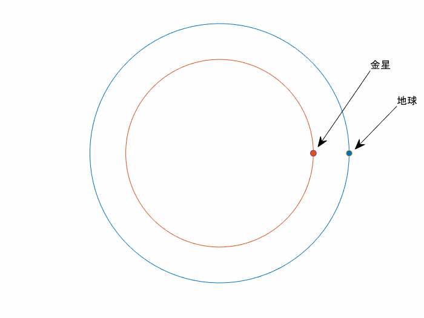
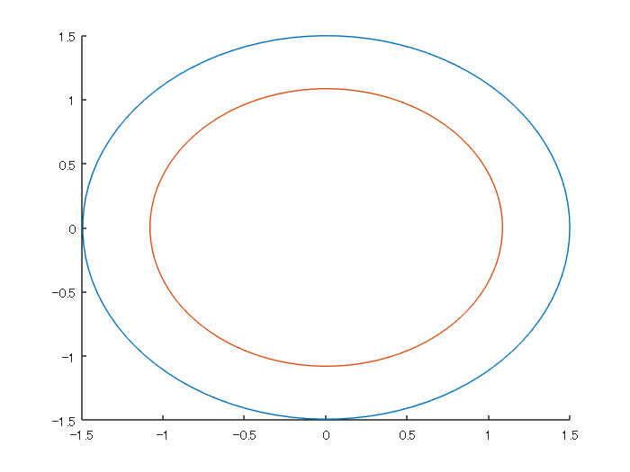
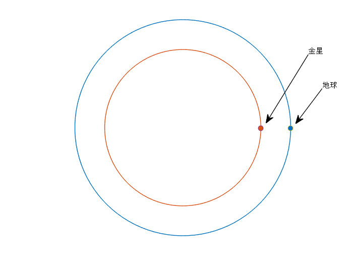
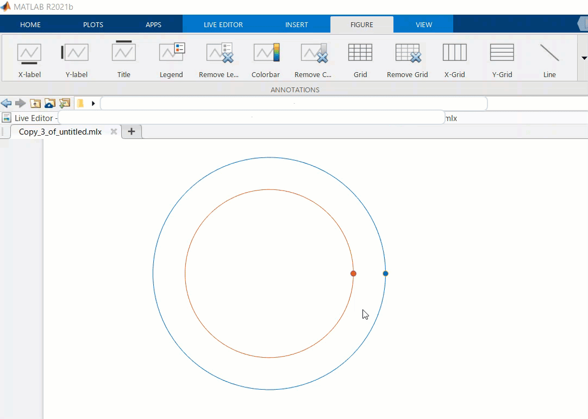
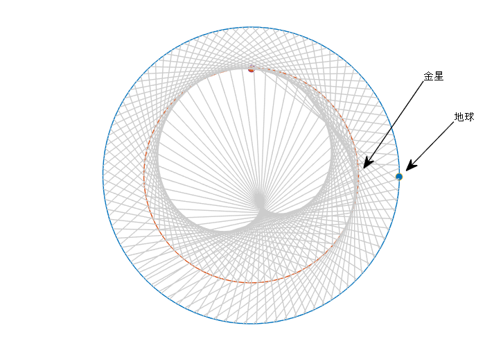
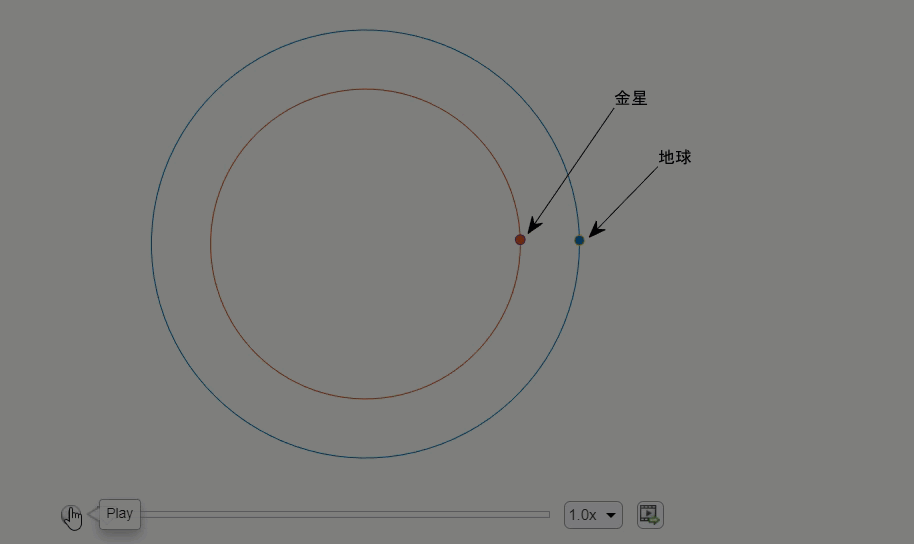
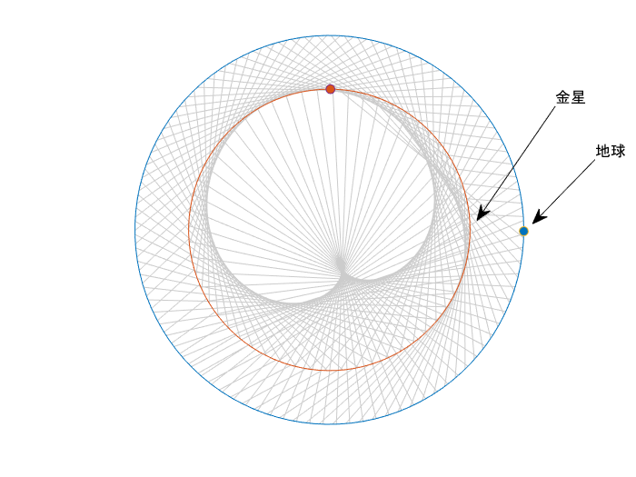
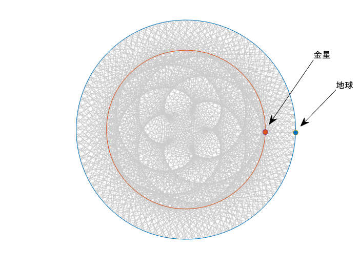

# Spirograph Pattern: The Rose of Venus

Copyright (c) 2021 Michio Inoue


[](https://matlab.mathworks.com/open/github/v1?repo=minoue-xx/The-Rose-of-Venus)


# はじめに

金星と地球の位置を定期的に結ぶと浮き上がってくる「金星の薔薇」、金星と地球は公転周期が 8:13 という関係あることから、一定時間毎に金星と地球の位置を線で結ぶと「五弁花」が描けるんだとか。

参考：[https://twitter.com/gakugei_osm/status/1393794165759115266](https://twitter.com/gakugei_osm/status/1393794165759115266)

この描画過程を MATLAB で再現してみます！



地球と金星を 4 日おきに 8 年間結線したものです。静止画であれば 260 文字程度で終わるんですが（参照：先日行われた [MATLAB Mini Hack での投稿](https://www.mathworks.com/matlabcentral/communitycontests/contests/4/entries/3621)）アニメーションならではのポイントをお伝えできればと思います。

## 紹介ポイント

主な MATLAB のコツは以下の通り

   -  極座標への変換 
   -  オブジェクト位置関係の変更 
   -  アニメーション作成 
   -  文字の挿入方法 

## 使用環境

   -  MATLAB R2021b  

# まずは諸設定

地球・金星それぞれの軌道は円として、極座標で考えるとよさそうですね。Wikipedia を参考にするとそれぞれ

   -  金星：平均公転半径 1.082 億 km 公転周期 224.7 日 ([Wikipedia: 金星](https://ja.wikipedia.org/wiki/%E9%87%91%E6%98%9F)) 
   -  地球：平均公転半径 1.495 億 km 公転周期 365.2 日 ([Wikipedia: 地球](https://ja.wikipedia.org/wiki/%E5%9C%B0%E7%90%83)) 

だそうな。

```matlab:Code
close all
clear

rhoE = 1.495;
rhoV = 1.082;
periodE = 365.2; % 364
periodV = 224.7; % 224

h_figure = figure;
h_axes = axes;
hold on;
```

# まずは地球と金星の軌道から

簡単なところから。ここでは軌道は円と仮定します。座標は極座標系を用いて表現し、`plot` 関数で描くために `pol2cart` で変換します。

```matlab:Code
[xE,yE] = pol2cart(linspace(0,2*pi,100), rhoE);
[xV,yV] = pol2cart(linspace(0,2*pi,100), rhoV);
h1orbit = plot(xE,yE,xV,yV);
```



## 惑星も追加

あと軌道が綺麗な円には見えませんね。`axis equal` で縦と横の比率を 1:1 に設定し、`さらに`枠があると色気がないので `axis off` で消します。軌道と同じ色になるよう既定の色順を `colors` に確保しておき、1番目と2番目の色を使います。

```matlab:Code
colors = colororder;
hE_point = plot(rhoE,0,'o',MarkerFaceColor = colors(1,:));
hV_point = plot(rhoV,0,'o',MarkerFaceColor = colors(2,:));
axis off equal

annotation('textarrow',[0.8732 0.7536],[0.7942 0.5357],'String','金星')
annotation('textarrow',[0.9125 0.8375],[0.6657 0.5333],'String','地球')
```



それぞれの点（惑星）は後で動かすのでハンドルを変数（`hE_point`, `hV_point`）として確保しておきますね。

ここまでの処理は繰り返し使いたいので

```matlab:Code(Display)
[hE_point, hV_point] = drawOrbits(rhoE, rhoV)
```

としてまとめておきます。ページ下部参照。

## 文字と矢印の挿入

この位置設定が地味に面倒くさい。ここは Live Editor の機能を使って楽できます。間違って火星って入れちゃってますけどね。



# 地球と金星を結ぶ

4 日置きに、地球と金星を結ぶ線を追加してみることにします。まずは一日当たりの回転角度を定義。

```matlab:Code(Display)
dthetaE = 2*pi/periodE;
dthetaV = 2*pi/periodV;
```

４日置きに、というところは `mod(ii,4) == 0` という条件を満たす時に `plot` で追加。

```matlab:Code(Display)
    if mod(ii,4) == 0 
        plot([xE xV],[yE yV], LineStyle="-", Color=[0.8 0.8 0.8]);
    end
```

地球と金星（`hE_point/hV_point`）の座標が変わるたびに改めて `plot` してもできますが、効率よくいくならそれぞれの XData/YData プロパティを直接編集してやるのがおススメです。`pol2cart` で極座標系から変換して XData/YData に代入します。

```matlab:Code(Display)
    hE_point.XData = xE;
    hE_point.YData = yE;
```

for ループの毎ステップきちんと絵を描くには drawnow を忘れずに。とりあえず 2 年回してみます。

```matlab:Code
figure
[hE_point, hV_point] = drawOrbits(rhoE, rhoV);

dthetaE = 2*pi/periodE;
dthetaV = 2*pi/periodV;

for ii=1:365*2 % 2 years
    thetaE = dthetaE*ii;
    [xE,yE] = pol2cart(thetaE,rhoE);
    hE_point.XData = xE;
    hE_point.YData = yE;

    thetaV = dthetaV*ii;
    [xV,yV] = pol2cart(thetaV,rhoV);
    hV_point.XData = xV;
    hV_point.YData = yV;

    if mod(ii,4) == 0 % (~mod(ii,4)
        plot([xE xV],[yE yV], LineStyle="-", Color=[0.8 0.8 0.8]);
    end

    %drawnow % 最終的な画だけ欲しい時はコメントアウト
end
```



\matlabheadingtwo{}
## 軌道が隠れる・・

これは金星と地球を結ぶ線が追加される度に、その線が一番上に表示されるからです。これは美しくない。とはいえ毎回軌道を書き直すのもイケていない。こんな時は ”**プロットの順番を変える**”、ということをします。あまり意識する機会はないですが、オブジェクトは内部的な順番で表示されていますので、下にあるものは隠される挙動となっています。以下にもヒントがあります。

   -  Qiita: [[matlab] 隠れちゃった線を手前に持ってくる](https://qiita.com/sshojiro/items/45934c4a0f795dd98b0c) 
   -  MATLAB Answers: [プロット表示されたグラフにおいて、任意のラインを一番上に表示させる方法はありますか？ - MATLAB Answers - MATLAB Central](http://jp.mathworks.com/matlabcentral/answers/103931-) 

順番を変えるには

```matlab:Code(Display)
h_obj = get(gca,'Children');
set(gca,'Children',h_obj([2:end,1]));
```

こんな感じでＯＫです。座標軸（gca）上にあるオブジェクトをすべて取り出して、一番最近追加されたオブジェクトを最後に持ってくる・・そんなことをしています。

```matlab:Code
figure
[hE_point, hV_point] = drawOrbits(rhoE, rhoV);

for ii=1:365*2 % 2 years
    thetaE = dthetaE*ii;
    [xE,yE] = pol2cart(thetaE,rhoE);
    hE_point.XData = xE;
    hE_point.YData = yE;

    thetaV = dthetaV*ii;
    [xV,yV] = pol2cart(thetaV,rhoV);
    hV_point.XData = xV;
    hV_point.YData = yV;

    if mod(ii,4) == 0 % (~mod(ii,4)
        plot([xE xV],[yE yV], LineStyle="-", Color=[0.8 0.8 0.8]);
        h_obj = get(gca,'Children');
        set(gca,'Children',h_obj([2:end,1]));
    end

    % drawnow % 最終的な画だけ欲しい時はコメントアウト
end
```



いい感じですね。

# アニメーションを少し改善

これでほとんど完成ですが、最初から最後まで同じ速度で眺めるのも飽きてしまいます。なので最初はゆっくり・そして描かれる様子が分かった後は早送りするようなアニメーションにしてみます。これは画を描くコマンドの `drawnow` を呼ぶ間隔を空けることで実現できます。ざっくりこんな感じで。

```matlab:Code(Display)
     if ii < 40
         drawnow
     elseif ~mod(ii,16) && ii < 400
         drawnow
     elseif ~mod(ii,64)
         drawnow
     end
```

最初の40日間は毎日、400 日までは 16 日置き、そしてそれ以降は 64 日置きの描画になります。

```matlab:Code
figure
[hE_point, hV_point] = drawOrbits(rhoE, rhoV);

for ii=1:365*8 % 8 years
    thetaE = dthetaE*ii;
    [xE,yE] = pol2cart(thetaE,rhoE);
    hE_point.XData = xE;
    hE_point.YData = yE;

    thetaV = dthetaV*ii;
    [xV,yV] = pol2cart(thetaV,rhoV);
    hV_point.XData = xV;
    hV_point.YData = yV;

    if mod(ii,4) == 0 % (~mod(ii,4)
        plot([xE xV],[yE yV], LineStyle="-", Color=[0.8 0.8 0.8]);
        h_obj = get(gca,'Children');
        set(gca,'Children',h_obj([2:end,1]));
    end

    if ii < 40
        drawnow
    elseif ~mod(ii,16) && ii < 400
        drawnow
    elseif ~mod(ii,64)
        drawnow
    end
end
```



# まとめ

「金星の薔薇」のアニメーション作成工程をまとめました。同じプロットを描くことはおそらくないと思いますが

   -  極座標への変換 
   -  オブジェクト位置関係の変更 
   -  アニメーション作成 
   -  文字の挿入方法 

などは、もしかしたらいつか役立つかもしれません。そんな時こちらの投稿を思い出してもらえると嬉しいです。

# おまけ：アニメーション出力

R2021b からは Live Script からアニメーション出力ができるようになりましたが、細かい設定等できないので参考まで R2021a 以前の方法を以下に記載しておきます。一度書いておけばコマンドで処理できる分楽ができます。興味のある方は確認してみてください。

```matlab:Code
figure
[hE_point, hV_point] = drawOrbits(rhoE, rhoV);

filename = 'animation_sample.gif'; % ファイル名
frame = getframe(gcf); % Figure 画面をムービーフレーム（構造体）としてキャプチャ
tmp = frame2im(frame); % 画像に変更
[A,map] = rgb2ind(tmp,256); % RGB -> インデックス画像に
imwrite(A,map,filename,'gif','LoopCount',Inf,'DelayTime',0.1);

% あとは各 drawnow のタイミングに併せて同じ処理を繰り返してキャプチャした画像を追加していきます。
for ii=1:365*8 % 8 years
    thetaE = dthetaE*ii;
    [xE,yE] = pol2cart(thetaE,rhoE);
    hE_point.XData = xE;
    hE_point.YData = yE;

    thetaV = dthetaV*ii;
    [xV,yV] = pol2cart(thetaV,rhoV);
    hV_point.XData = xV;
    hV_point.YData = yV;

    if ~mod(ii,4)
        plot([xE xV],[yE yV], LineStyle="-", Color=[0.8 0.8 0.8]);
        h_obj = get(gca,'Children');
        set(gca,'Children',h_obj([2:end,1]));
    end

    if ii < 40
        drawnow
        appendFrame(gcf, filename,0.1); % delayTime = 0.1

    elseif ~mod(ii,16) && ii < 400
        drawnow
        appendFrame(gcf, filename,0.1); % delayTime = 0.1

    elseif ~mod(ii,64)
        drawnow
        appendFrame(gcf, filename,0.1); % delayTime = 0.1
    end

end

drawnow

% 最後のフレームは少し長めに
appendFrame(gcf, filename,2); % delayTime = 2
```


# Appendix：補助関数

Figure 画面を gif にアペンドする関数

```matlab:Code
function appendFrame(gcf, filename,delayTime) % Figure 画面をムービーフレーム（構造体）としてキャプチャ
frame = getframe(gcf); % Figure 画面をムービーフレーム（構造体）としてキャプチャ
tmp = frame2im(frame); % 画像に変更
[A,map] = rgb2ind(tmp,256); % RGB -> インデックス画像に
imwrite(A,map,filename,'gif',WriteMode='append',DelayTime=delayTime);% 画像をアペンド
end
```

ベースとなる軌道を描くプロット

```matlab:Code
function [hE_point, hV_point] = drawOrbits(rhoE, rhoV)

[xE,yE] = pol2cart(linspace(0,2*pi,100), rhoE);
[xV,yV] = pol2cart(linspace(0,2*pi,100), rhoV);
plot(xE,yE,xV,yV); % 軌道描画

hold on
colors = colororder;
hE_point = plot(rhoE,0,'o',MarkerFaceColor = colors(1,:));
hV_point = plot(rhoV,0,'o',MarkerFaceColor = colors(2,:));
axis off equal

annotation('textarrow',[0.9357 0.8375],[0.6657 0.531],String='地球')
annotation('textarrow',[0.8732 0.75],[0.7776 0.5381],String='金星')
end
```
